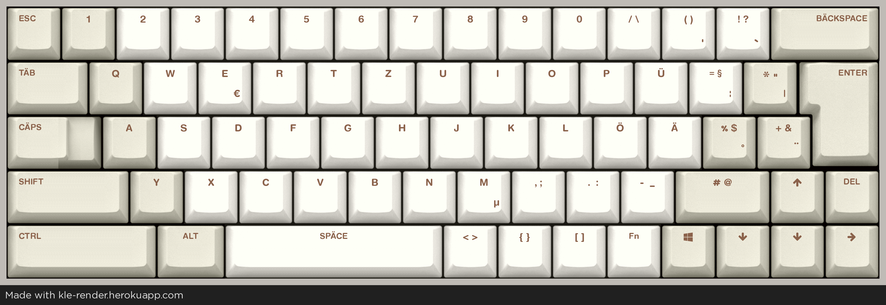

# Open-Source-Repository für das GG69-ISO Tastaturprojekt!
Ziel: funktionierende QMK-Firmware für die Community.
Dieses Projekt steht unter der **MIT License**.

### Hardware-Spezifikationen
* Mikrocontroller: STM32F072C8T6
* Layout: 65% ISO
* Matrix: 5 Rows x 15 Columns

# GG69-ISO-DEUS
## under construction...

# GG69-ISO-DACH
## wird ende Jahr bereitgestellt

