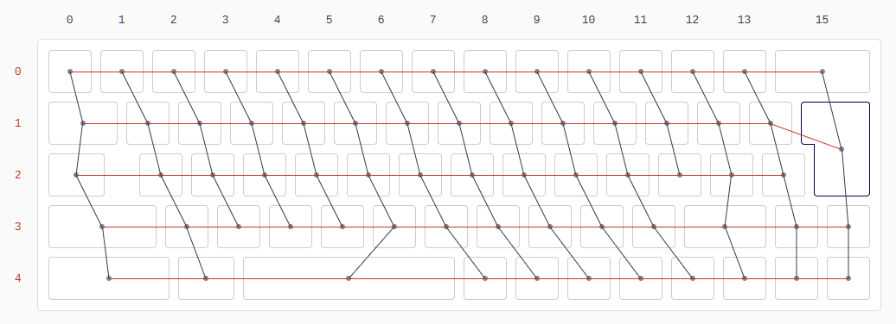
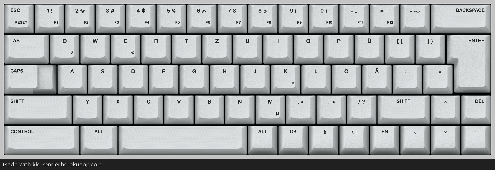

# GG69 ISO

### Hardware-Specs
* MCU:    STM32F072C8T6
* Socket: Kailh Hotswap
* Layout: 65% ISO
* Matrix: 5 Rows x 16 Columns
### Nonflex, case mounted PCB with Clip in Stabs
* Steped Caps Lock Key
* custom 4.25u lubed Stab and Spacebar Key
* custom 2.50u lubed Stab and Left Control Key

## GG69-ISO-DEUS
* Release December 2025
### a 60% US layout with ISO Enter Key and additional 65% column for german Ä, Ö, Ü

## GG69-ISO-CH
* Release 2026
 
## GG69-ISO-GER
* Release 2026

## GG69-ISO-DACH
* Release 2026
