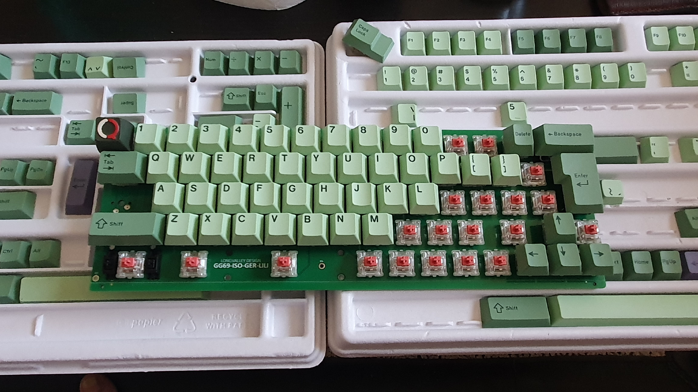

# GG69-ISO-GER

Open-Source-Repository für das GG69-ISO-GER Tastaturprojekt!

Eine 65%-Tastatur mit ISO-DE-Layout mit STM32F072C8T6 Mikrocontroller.
### Ziel: funktionierende QMK-Firmware für die Community.

---

Dieses Projekt steht unter der **MIT License**.

---

### Hardware-Spezifikationen

* Mikrocontroller: STM32F072C8T6
* Layout: 65% ISO-GER-DACH
* Matrix: 5 Rows x 15 Columns

---

### Projektstatus

* Aktuell haben wir die Hardware-Dateien bereitgestellt.
* Die nächsten Schritte sind die Entwicklung einer funktionierenden QMK-Firmware.

---

### Dokumentation

* Schaltplan: `gg69_shematic.pdf`
* Tasten-Matrix: `gg69_matrix.png`
* Keymap-Layout: `gg69_keymaping.jpg`
* Bild der Vorderseite
* Bild der Rückseite

---

### Mitmachen

Wir freuen uns über jede Unterstützung aus der Community! Wenn Sie helfen möchten, können Sie:

* Fehlerberichte oder Verbesserungsvorschläge als Issue einreichen.
* Firmware-Code entwickeln oder verbessern und einen Pull Request erstellen.
* Dokumentation und Beschreibungen verbessern.

GG69-ISO-GER Eine Open-Source-Tastatur für die deutsche Community!

